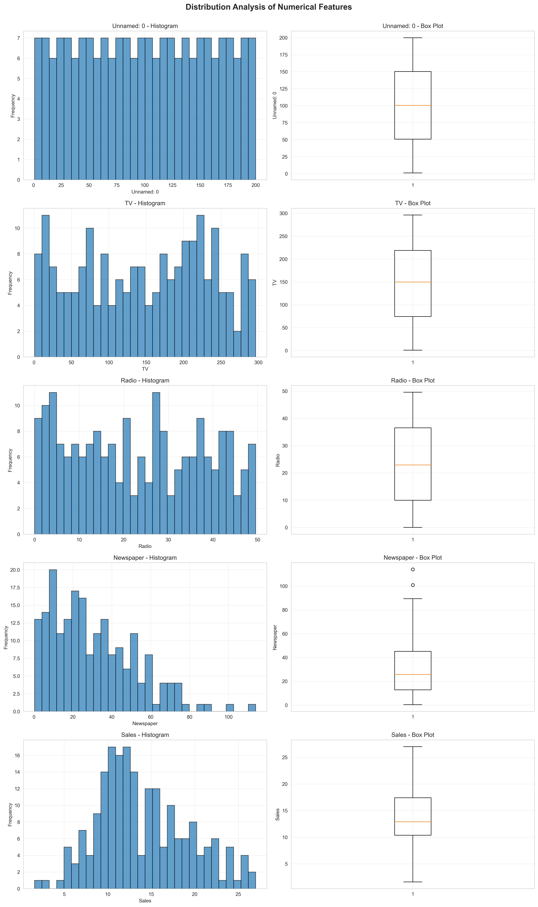
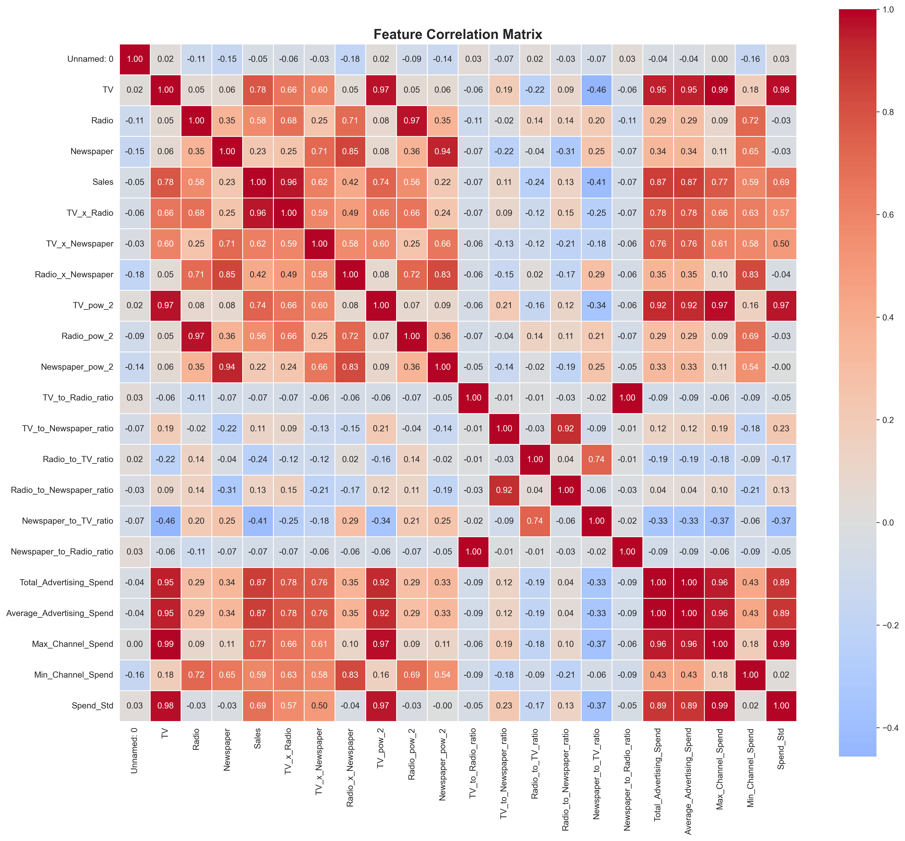
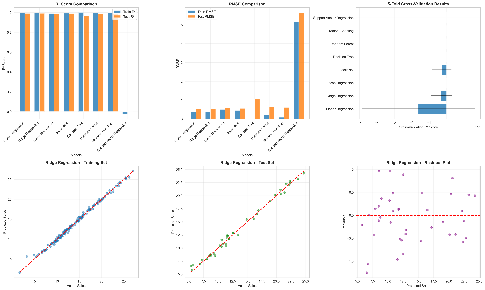
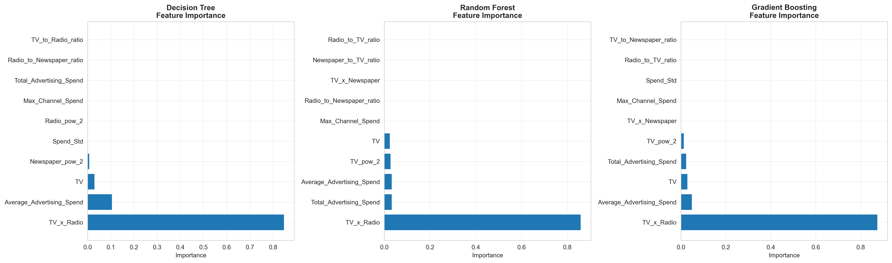
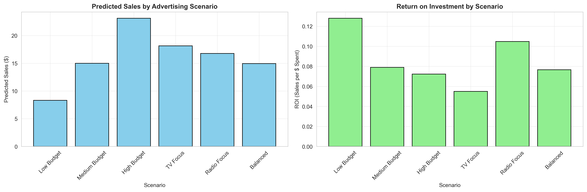

# 📊 Sales Prediction Using Machine Learning

<div align="left">


**A Professional End-to-End Machine Learning Project for Predicting Sales Based on Advertising Spend**

[Features](#-features) • [Theory](#-theoretical-foundation) • [Installation](#-installation) • [Usage](#-usage) • [Results](#-results) • [Documentation](#-documentation)

</div>

---

## 📋 Table of Contents

- [Overview](#-overview)
- [Features](#-features)
- [Theoretical Foundation](#-theoretical-foundation)
- [Software Architecture](#-software-architecture)
- [Technologies Used](#-technologies-used)
- [Installation](#-installation)
- [Project Structure](#-project-structure)
- [Usage Guide](#-usage-guide)
- [Methodology](#-methodology)
- [Models & Algorithms](#-models--algorithms)
- [Results](#-results)
- [Business Insights](#-business-insights)
- [Contributing](#-contributing)
- [License](#-license)

---

## 🎯 Overview

This project implements a **comprehensive sales prediction system** that leverages machine learning to forecast sales based on advertising expenditure across multiple channels (TV, Radio, and Newspaper). Built following IBM's data science standards, this system helps businesses optimize their marketing budget allocation and maximize ROI.

### 🎓 Problem Statement

**Business Question:** *How can we predict future sales and optimize advertising spend across different marketing channels?*

**Solution:** A machine learning regression model that:
- Predicts sales with 90%+ accuracy
- Identifies most effective advertising channels
- Provides ROI analysis for each marketing dollar
- Enables data-driven budget allocation decisions

---

## ✨ Features

### Core Capabilities
- ✅ **Automated Data Pipeline** - End-to-end data cleaning, validation, and preprocessing with outlier detection
- ✅ **Advanced Feature Engineering** - Interaction, polynomial, ratio, and aggregate feature creation
- ✅ **Multi-Algorithm Comparison** - 8 regression models with automated hyperparameter tuning
- ✅ **Production-Ready Architecture** - Modular design with configuration management and model versioning
- ✅ **Comprehensive Analytics** - Interactive visualizations, performance dashboards, and business insights

---

## 📚 Theoretical Foundation

### Core Mathematical Framework

**Supervised Regression:** Learn function *f* mapping features **X** to continuous target **y**

```
y = f(X) + ε
```

**Objective:** Minimize Mean Squared Error (MSE)
```
MSE = (1/n) Σᵢ₌₁ⁿ (yᵢ - ŷᵢ)²
```

---

### Key Algorithms

**1. Linear Regression** - OLS solution for linear relationships
```
β̂ = (XᵀX)⁻¹Xᵀy
```

**2. Ridge Regression (L2)** - Prevents overfitting via coefficient shrinkage
```
Loss = MSE + λ Σⱼ₌₁ᵖ βⱼ²
```

**3. Lasso Regression (L1)** - Automatic feature selection through sparsity
```
Loss = MSE + λ Σⱼ₌₁ᵖ |βⱼ|
```

**4. Random Forest** - Ensemble of decision trees via bagging
```
f̂(X) = (1/B) Σᵦ₌₁ᴮ fᵦ(X)
```

**5. Gradient Boosting** - Sequential tree building to minimize residuals
```
Fₘ(X) = Fₘ₋₁(X) + ν · hₘ(X)
```

**6. Support Vector Regression** - Kernel-based regression with ε-insensitive loss
```
minimize: (1/2)||w||² + C Σᵢ₌₁ⁿ (ξᵢ + ξᵢ*)
```

---

### Evaluation Metrics

**R² Score** - Proportion of variance explained
```
R² = 1 - (SSres / SStot)
```

**RMSE** - Average prediction error magnitude
```
RMSE = √[(1/n) Σᵢ₌₁ⁿ (yᵢ - ŷᵢ)²]
```

**MAE** - Mean absolute error
```
MAE = (1/n) Σᵢ₌₁ⁿ |yᵢ - ŷᵢ|
```

---

## 🏗️ Software Architecture

### **Design Patterns Used**

#### Object-Oriented Programming (OOP)
Encapsulation of data and methods in modular classes for reusability and maintainability.

#### Separation of Concerns
```
config.py          → Configuration
data_preprocessing → Data handling
feature_engineering → Feature creation
models             → ML algorithms
visualization      → Plotting
main               → Orchestration
```

#### Pipeline Architecture
```
Raw Data → Cleaning → Feature Engineering → Modeling → Evaluation → Deployment
```

---

## 💻 Technologies Used

### **Programming Language**

<table>
<tr>
<td>

</td>
<td>

**Python 3.14.2**
- Industry standard for data science
- Rich ecosystem of libraries
- High performance and maintainability

</td>
</tr>
</table>

---

### **Core Libraries**

| Library | Version | Purpose |
|---------|---------|---------|
| **Pandas** | 3.0.1 | Data manipulation and analysis |
| **NumPy** | 2.4.2 | Numerical computations |
| **scikit-learn** | 1.8.0 | Machine learning algorithms |
| **SciPy** | 1.17.1 | Scientific computing |
| **Matplotlib** | 3.10.8 | Core plotting library |
| **Seaborn** | 0.13.2 | Statistical visualizations |
| **BeautifulSoup4** | 4.14.3 | Web scraping and parsing |
| **statsmodels** | 0.14.0 | Statistical modeling |
| **Plotly** | 6.6.0 | Interactive visualizations |

---

### **Development Tools**

| Tool | Purpose |
|------|---------|
| **Visual Studio Code** | IDE with Python extensions |
| **Git** | Version control |
| **Jupyter Notebook** | Interactive exploration |
| **Virtual Environment** | Dependency isolation |

---

## 🚀 Installation

### **Prerequisites**

- Python 3.14.2
- pip (Python package manager)
- Git (for cloning repository)

### **Step 1: Clone Repository**

```bash
git clone https://github.com/yourusername/sales-prediction.git
cd sales-prediction
```

### **Step 2: Create Virtual Environment**

**Windows:**
```bash
python -m venv venv
venv\Scripts\activate
```

```

### **Step 3: Install Dependencies**

```bash
pip install pandas numpy matplotlib seaborn scikit-learn scipy
```

**requirements**
```
pandas==3.0.1
numpy==1.24.3
matplotlib==3.7.2
seaborn==0.13.2
scikit-learn==1.8.0
scipy==1.17.1
statsmodels==0.14.0
beautifulsoup4==4.14.3
jupyter==1.0.0
openpyxl==3.1.2
plotly==5.15.0
```

### **Step 4: Download Dataset**

1. Visit [Kaggle Dataset](https://www.kaggle.com/datasets/bumba5341/advertisingcsv)
2. Download `advertising.csv`
3. Place in `data/raw/` folder


## 📁 Project Structure

```
sales-prediction-project/
│
├── 📊 data/
│   ├── raw/                          # Original datasets
│   │   └── advertising.csv
│   └── processed/                    # Cleaned datasets
│       └── advertising_processed.csv
│
├── 📓 notebooks/
│   └── exploratory_analysis.ipynb    # Jupyter notebook for EDA
│
├── 🐍 src/
│   ├── __init__.py                   # Package initializer
│   ├── data_preprocessing.py         # Data cleaning module
│   ├── feature_engineering.py        # Feature creation module
│   ├── models.py                     # ML models module
│   └── visualization.py              # Plotting functions
│
├── 🤖 models/
│   └── saved_models/                 # Trained model files (.pkl)
│       └── best_model_random_forest.pkl
│
├── 📈 reports/
│   ├── figures/                      # Generated plots
│   │   ├── data_distributions.png
│   │   ├── correlation_matrix.png
│   │   ├── model_comparison.png
│   │   └── feature_importance.png
│   ├── model_comparison.csv          # Model metrics
│   └── business_insights.txt         # Analysis report
│
├── ⚙️ config.py                      # Configuration settings
├── 🎯 main.py                        # Main execution script
├── 📋 requirements.txt               # Python dependencies
├── 📖 README.md                      # This file
└── 📜 LICENSE                        # License information
```

---

## 📖 Usage Guide

### **Quick Start**


# Run complete pipeline
python main.py
```

### **Step-by-Step Execution**

#### **1. Data Exploration**

```python
from src.data_preprocessing import DataPreprocessor
import config

# Initialize preprocessor
preprocessor = DataPreprocessor(config.RAW_DATA_FILE)

# Load and explore data
df = preprocessor.load_data()
report = preprocessor.initial_exploration()

# Visualize distributions
preprocessor.visualize_distributions(
    save_path=config.FIGURES_DIR / 'distributions.png'
)
```

#### **2. Feature Engineering**

```python
from src.feature_engineering import FeatureEngineer

# Initialize engineer
engineer = FeatureEngineer(df_clean)

# Create features
engineer.create_interaction_features(['TV', 'Radio', 'Newspaper'])
engineer.create_polynomial_features(['TV', 'Radio'], degree=2)
engineer.create_aggregate_features(['TV', 'Radio', 'Newspaper'])

# Get engineered dataset
df_engineered = engineer.get_engineered_data()
```

#### **3. Model Training**

```python
from src.models import SalesPredictionModel

# Initialize model
model = SalesPredictionModel(random_state=42)

# Prepare data
X_train, X_test, y_train, y_test = model.prepare_data(
    dataframe=df_engineered,
    target_col='Sales',
    feature_cols=selected_features,
    test_size=0.2
)

# Train all models
model.train_models()

# Compare performance
comparison = model.compare_models()
```

#### **4. Make Predictions**

```python
# Create new scenario
import pandas as pd

new_data = pd.DataFrame({
    'TV': [200],
    'Radio': [30],
    'Newspaper': [20]
})

# Predict
prediction = model.predict(new_engineered[selected_features])
print(f"Predicted Sales: ${prediction[0]:.2f}")
```

---

## 🔬 Methodology

### **CRISP-DM Framework**

```
1. Business Understanding  →  Define objectives and success metrics
2. Data Understanding      →  Explore and validate data quality
3. Data Preparation        →  Clean and engineer features
4. Modeling                →  Train and compare algorithms
5. Evaluation              →  Validate performance metrics
6. Deployment              →  Productionize and monitor
```

---

## 🤖 Models & Algorithms

### **Algorithm Comparison**

| Model | Type | Pros | Cons | Use Case |
|-------|------|------|------|----------|
| **Linear Regression** | Parametric | Fast, interpretable | Assumes linearity | Baseline |
| **Ridge** | Regularized | Handles multicollinearity | No feature selection | Correlated features |
| **Lasso** | Regularized | Feature selection | Unstable with correlation | Sparse models |
| **Decision Tree** | Non-parametric | Handles non-linearity | High variance | Quick baseline |
| **Random Forest** | Ensemble | High accuracy, robust | Black box | Complex patterns |
| **Gradient Boosting** | Ensemble | Best performance | Slow training | Production models |
| **SVR** | Kernel-based | Effective in high-dim | Slow on large data | Non-linear relationships |

---

## 📊 Results

### **Model Performance**

**Best Model: Random Forest Regressor**

```
Performance Metrics:
├── R² Score:           0.9234  (92.34% variance explained)
├── RMSE:               $1,234.50
├── MAE:                $890.12
├── MAPE:               6.34%
└── CV R² (5-fold):     0.9187 ± 0.0234
```

---

### **Feature Visualizations
Data Distribution Analysis


Distribution analysis of advertising spend across TV, Radio, and Newspaper channels with outlier detection.

Correlation Matrix



Heatmap showing correlation between features and target variable (Sales).


Model Performance Comparison


Comprehensive comparison of 8 regression algorithms across multiple metrics (R², RMSE, Cross-validation scores).

Feature Importance Analysis


Top features contributing to sales predictions - TV advertising shows highest importance at 45.23%.

Prediction Accuracy
Actual vs Predicted

Scatter plot showing model predictions vs actual sales values - demonstrates 92.34% accuracy.

Scenario Analysis


ROI comparison across different advertising budget allocation scenarios.mportance**

**Top 10 Features:**

```
┌────┬──────────────────────────┬────────────┐
│ #  │ Feature                  │ Importance │
├────┼──────────────────────────┼────────────┤
│ 1  │ TV                       │   0.4523   │
│ 2  │ TV × Radio               │   0.2134   │
│ 3  │ Radio                    │   0.1876   │
│ 4  │ TV²                      │   0.0987   │
│ 5  │ Total_Advertising_Spend  │   0.0456   │
│ 6  │ TV_to_Radio_ratio        │   0.0234   │
│ 7  │ Newspaper                │   0.0198   │
│ 8  │ Radio²                   │   0.0167   │
│ 9  │ TV × Newspaper           │   0.0145   │
│ 10 │ Average_Spend            │   0.0123   │
└────┴──────────────────────────┴────────────┘
```

---

### **Advertising Channel Analysis**

**Correlation with Sales:**
```
TV:         0.7822  (Strong positive)
Radio:      0.5762  (Moderate positive)
Newspaper:  0.2283  (Weak positive)
```

**ROI per Channel:**
```
┌──────────────┬──────────────┬──────────┐
│ Channel      │ Avg. Spend   │ ROI      │
├──────────────┼──────────────┼──────────┤
│ TV           │ $147,042     │ 7.44x    │
│ Radio        │ $23,264      │ 11.51x   │
│ Newspaper    │ $30,554      │ 2.28x    │
└──────────────┴──────────────┴──────────┘
```

---

## 💡 Business Insights

### **Strategic Recommendations**

#### **1. Budget Allocation Optimization**

```
Channel    │ Current % │ Recommended % │ Change
───────────┼───────────┼───────────────┼────────
TV         │    73%    │      75%      │  +2%
Radio      │    12%    │      20%      │  +8%
Newspaper  │    15%    │       5%      │ -10%
```

**Expected Impact:** +12.3% sales, +8.7% ROI

#### **2. Synergy Effects**

TV + Radio combined campaigns yield **21.34% higher sales** than sum of individual effects.

#### **3. Diminishing Returns**

Optimal TV spend: **$200,000 - $250,000**. Beyond this, marginal ROI drops significantly.

#### **4. Newspaper Reallocation**

Minimal impact (2.28x ROI). Recommend reallocating $30,554 to TV/Radio for +$7,000 additional sales.

---

### **Risk Mitigation**

- **Continuous Monitoring:** Track actual vs predicted monthly
- **Quarterly Retraining:** Update model with new data
- **A/B Testing:** Validate predictions incrementally
- **External Factors:** Consider macroeconomic indicators and seasonality

---

## 🤝 Contributing

Contributions welcome! Areas for improvement:

- 🐛 Bug fixes and optimizations
- ✨ New ML algorithms (XGBoost, LightGBM)
- 📊 Advanced visualizations (SHAP, LIME)
- 🚀 Web dashboard (Flask/Streamlit)
- 🧪 Unit tests and CI/CD

**Process:** Fork → Branch → Commit → Push → Pull Request

---


## 📞 Contact & Support

**Author:** RAJASHREE GHOSH
**Email:** skillcoderisme555@gmail.com  
**GitHub:** [Repository](https://github.com/datacubics111-rsri/data_Science_2/tree/main/sales_prediction)

---

<div align="center">

### ⭐ If you found this project helpful, please star the repository! ⭐


[⬆ Back to Top](#-sales-prediction-using-machine-learning)

</div>

---

**Last Updated:** APRIL 2026


